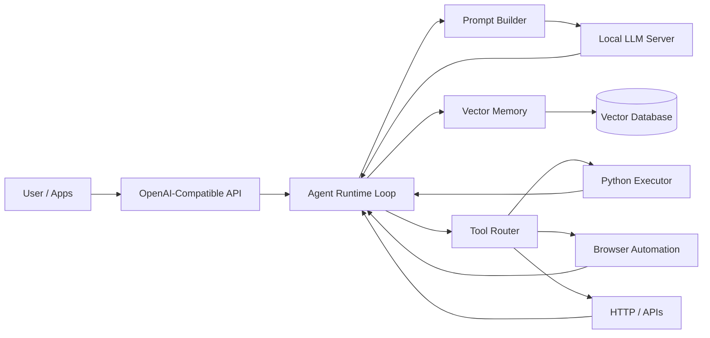

# Mantis — Personal AI Assistant

    <picture>
        <source media="(prefers-color-scheme: light)" srcset="docs/assets/mantis-logo.png">
        
    </picture>

  <strong>AUTOMATE! AUTOMATE!</strong>

**Mantis** is a minimal, extensible personal AI runtime for autonomous task execution with local LLMs, vector memory, and tool orchestration.

---

## Architecture

---

## How it works

Every request triggers a short autonomous agent cycle.

1. **Request enters the API**
   Messages from the UI, CLI, or integrations are received through an OpenAI-compatible endpoint.

2. **Context is assembled**
   The runtime gathers recent conversation plus relevant long-term memories retrieved from the vector database.

3. **The agent decides what to do**
   The LLM receives the full context and chooses the next action:

   * reply to the user
   * call a tool
   * store new memory

4. **Tools execute real actions**
   If a tool is requested, Mantis runs code, fetches data, or automates tasks and feeds the result back into the loop.

5. **Response is returned**
   The loop ends when the agent produces a final answer.

This cycle transforms a chat model into a persistent, tool-using personal AI runtime.

Add the links directly in the inspiration section.

---

## Inspiration

Mantis is inspired by two excellent open-source projects that helped shape the modern personal-AI runtime pattern:

* **OpenClaw** — local LLM agent runtime focused on autonomy and tool usage
  [https://github.com/OpenClaw/OpenClaw](https://github.com/OpenClaw/OpenClaw)

* **PicoClaw** — lightweight multi-provider agent with skills, gateways, and scheduling
  [https://github.com/sipeed/picoclaw](https://github.com/sipeed/picoclaw)

Both projects demonstrate the same core idea: people want their **own AI runtime**, not just an API.

---

## How Mantis differs

While these projects are powerful, they are also large, feature-rich systems.

Mantis intentionally takes a different approach:

**Mantis distills the core architecture down to its essentials.**

Instead of starting with many integrations and features, Mantis focuses on the smallest set of components required to build a personal AI runtime.

---

### What we kept

From OpenClaw:

* Autonomous agent loop
* Local-first LLM workflow
* Tool orchestration model

From PicoClaw:

* OpenAI-compatible API surface
* Modular tool / skill mindset
* Gateway-friendly architecture

These ideas form the foundation of the ecosystem.

---

### What we simplified

Mantis removes everything non-essential and rebuilds the stack from first principles.

The goal is clarity over complexity.

Mantis is designed to be:

* Easy to understand
* Easy to run locally
* Easy to extend
* Easy to learn from

It is a **reference implementation**, not a feature race.

---

## Philosophy

OpenClaw and PicoClaw show what a full agent platform can become.
Mantis focuses on the smallest architecture that makes that future possible.

Think of it as:

* The minimal kernel
* The clean blueprint
* The learning-friendly runtime

A foundation that anyone can read, run, and build upon.
