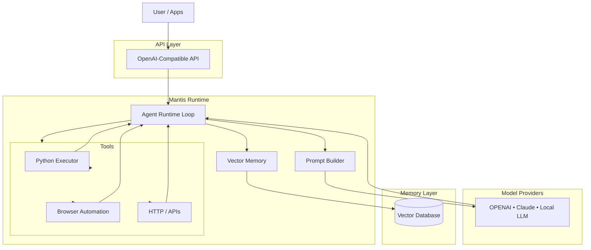

# Mantis — Personal AI Runtime

<p align="center">
  
</p>

<p align="center">
  <strong>AUTOMATE • THINK • EXECUTE</strong>
</p>

---

**Mantis** is a minimal, extensible personal AI runtime for autonomous task execution using **OpenAI, Claude, or local LLMs** with vector memory and tool orchestration.

Bring your own model. Run your own agent. Own your AI stack.

---

## Features

* OpenAI-compatible API
* Works with **OpenAI, Claude, or Local LLMs**
* Autonomous agent loop
* Tool orchestration system
* Vector memory (RAG)
* Runs fully local if desired
* Minimal, hackable architecture

---

## Quick start
```bash
pip install -r requirements.txt
ollama pull qwen2.5:7b-instruct
uvicorn app:app --reload --port 8001
```

Then connect the React UI to `http://localhost:8001/v1/chat/completions`.
Open docs at `http://localhost:8001/docs`.

Defaults:
- Ollama endpoint: `http://localhost:11434` (override with `OLLAMA_BASE_URL`)
- Model: `qwen2.5:7b-instruct` (override with `OLLAMA_MODEL`)
- Vector memory path: `.mantis/chroma` (override with `MANTIS_CHROMA_DIR`)

Tool calls: the agent emits `TOOL: tool_name | input`. Supported tools in the MVP are `python` (executes Python code locally — WARNING: full system access) and `http` (fetches a URL and returns the first ~2000 chars of cleaned text).

Try this to validate loop + tools:
```bash
curl -X POST http://localhost:8001/v1/chat/completions \
  -H "Content-Type: application/json" \
  -d '{"model":"mantis-local-agent","messages":[{"role":"user","content":"fetch https://example.com and summarize it"}]}'
```

---

## Why Mantis exists

Most AI products today are:

* APIs
* chat apps
* hosted platforms

Mantis is a **personal AI runtime**.

Software that sits between:

* you
* your tools
* your data
* your models

Goals:

* Bring Your Own LLM (OpenAI / Claude / Local)
* Avoid vendor lock-in
* Run locally and privately
* Learn how agent systems actually work
* Provide a clean reference architecture for builders

---

## Architecture



<p>Mantis is designed as a personal AI runtime.
The system sits between users, tools, data, and model providers, enabling autonomous task execution with full control over models and integrations.</p>

<a href='docs/diagrams/FULL_UML_Diagram.mermaid'>Full diagram</a>

---

## How it works

Every request triggers a short autonomous agent cycle.

1. **Request enters the API**
   Messages from UI, CLI, or integrations are received via an OpenAI-compatible endpoint.

2. **Context is assembled**
   The runtime gathers recent conversation and retrieves relevant long-term memories from the vector database.

3. **The agent decides the next action**
   The LLM chooses whether to:

   * reply to the user
   * call a tool
   * store new memory

4. **Tools execute real actions**
   Mantis can run code, fetch data, or automate tasks and feed results back into the loop.

5. **Response is returned**
   The loop ends when the agent produces a final answer.

This transforms a chat model into a persistent, tool-using personal AI runtime.

---

## Bring Your Own LLM

Mantis is model-agnostic.

Use whichever provider you prefer:

* OpenAI
* Anthropic Claude
* Ollama / Local GGUF models
* LM Studio
* Future providers

Your runtime. Your model. Your choice.

---

## Inspiration

Mantis is inspired by:

* OpenClaw
  [https://github.com/OpenClaw/OpenClaw](https://github.com/OpenClaw/OpenClaw)

* PicoClaw
  [https://github.com/sipeed/picoclaw](https://github.com/sipeed/picoclaw)

These projects helped shape the modern personal-AI runtime pattern.

---

## How Mantis differs

Mantis distills the core architecture down to its essentials.

Instead of a large feature-heavy platform, Mantis focuses on the smallest set of components required to build a personal AI runtime.

### What we kept

From OpenClaw:

* Autonomous agent loop
* Local-first workflow
* Tool orchestration

From PicoClaw:

* OpenAI-compatible API
* Modular tool mindset
* Gateway-friendly architecture

### What we simplified

Mantis prioritizes:

* clarity
* minimalism
* hackability
* learnability

It is a **reference implementation**, not a feature race.

---

## Project status

Currently in the **design and architecture phase**.

### Phase 1 — MVP

* OpenAI-compatible API
* Local LLM integration
* Agent loop
* Basic tools
* Vector memory

### Phase 2

* Browser automation
* Task scheduling
* Background agents

### Phase 3

* Plugin / skill system
* Multi-agent workflows
* Deployment options

---

## Planned modules

| Module | Responsibility                  |
| ------ | ------------------------------- |
| API    | OpenAI-compatible interface     |
| Agent  | Autonomous reasoning loop       |
| Tools  | Code execution and integrations |
| Memory | Vector storage and retrieval    |

---

## Contributing

Mantis is designed to be a learning-friendly open-source project.

Contributions welcome:

* architecture ideas
* documentation
* tooling
* early implementation

---

## License

MIT License
