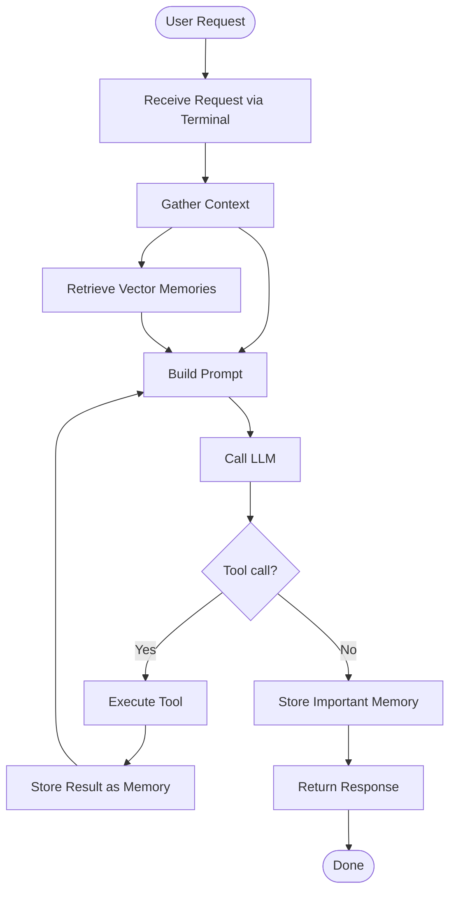

```mermaid
flowchart TD

Start([User Request])

Start --> API[Receive Request via Terminal]
API --> Context[Gather Context]

Context --> Retrieve[Retrieve Vector Memories]
Context --> BuildPrompt[Build Prompt]

Retrieve --> BuildPrompt
BuildPrompt --> LLM[Call LLM]

LLM --> Decision{Tool call?}

Decision -->|Yes| ToolExec[Execute Tool]
ToolExec --> StoreResult[Store Result as Memory]
StoreResult --> BuildPrompt

Decision -->|No| SaveMemory[Store Important Memory]
SaveMemory --> Respond[Return Response]

Respond --> End([Done])


```