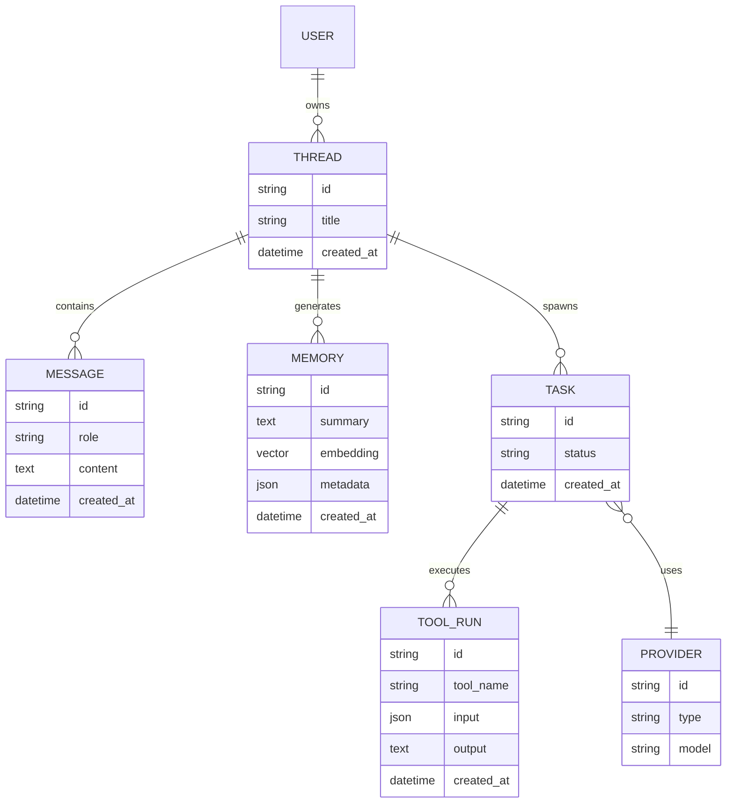

```mermaid

erDiagram

USER ||--o{ THREAD : owns
THREAD ||--o{ MESSAGE : contains
THREAD ||--o{ MEMORY : generates
THREAD ||--o{ TASK : spawns

MESSAGE {
  string id
  string role
  text content
  datetime created_at
}

THREAD {
  string id
  string title
  datetime created_at
}

MEMORY {
  string id
  text summary
  vector embedding
  json metadata
  datetime created_at
}

TASK {
  string id
  string status
  datetime created_at
}

TASK ||--o{ TOOL_RUN : executes

TOOL_RUN {
  string id
  string tool_name
  json input
  text output
  datetime created_at
}

PROVIDER {
  string id
  string type
  string model
}

TASK }o--|| PROVIDER : uses


```